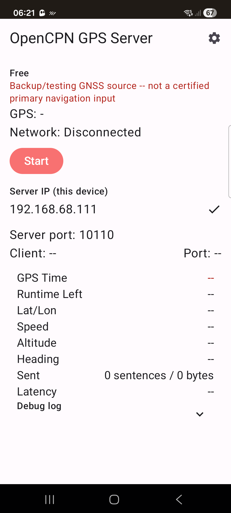
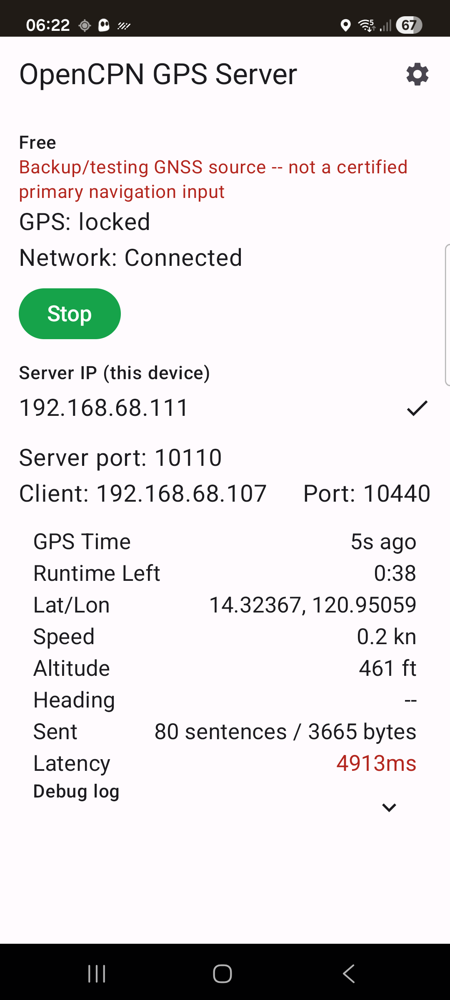
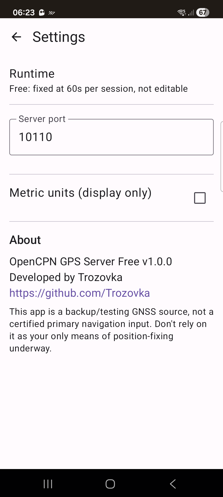

# OpenCPN GPS Server Free

Turns an Android phone into a Wi-Fi NMEA 0183 GPS server for [OpenCPN](https://opencpn.org/) running on a laptop, so a phone's GNSS chip can stand in for a USB GPS puck as OpenCPN's position source. The phone reads its own location and re-broadcasts fixes as `$GPGGA`/`$GPRMC`/`$GPVTG`/`$GPGSA` sentences over a TCP server socket; on the laptop, OpenCPN connects to it as a Network -> TCP client. There's no map or chart display on the phone itself -- the phone is purely the GPS relay, OpenCPN on the laptop is the actual ECDIS.

**This is a backup/testing GNSS source, not a certified primary navigation input.** Don't rely on it as your only means of position-fixing underway, and it isn't a type-approved ECDIS input.

This is the free **Free** tier: fully functional, but each server session auto-stops after 1 minute and needs a manual restart. A [Pro version](#pro-version) with unlimited runtime is sold separately.

Developed by [Trozovka](https://github.com/Trozovka).

## Screenshots

| Idle | Running, connected | Settings / About |
|---|---|---|
|  |  |  |

## Features

- Full NMEA 0183 output ($GPGGA/$GPRMC/$GPVTG/$GPGSA) at 1Hz with correct checksums, built from `FusedLocationProviderClient` (with a `LocationManager`/GPS fallback)
- Real Android foreground service with a partial wake lock -- keeps streaming with the screen locked, survives Doze once you grant the battery-optimization exemption
- Live telemetry: GPS lock status, lat/lon, speed, altitude, heading, sent sentence/byte counts, and fix-to-wire latency (flags in red past 500ms)
- Network interface picker for phones with more than one active connection (Wi-Fi, hotspot, USB tether)
- Metric/imperial display toggle (the NMEA wire output always stays in NMEA-native units, regardless of the toggle -- that's what OpenCPN expects)
- Each session runs for 1 minute, then auto-stops with an in-app upgrade prompt -- a real trial, not a crippled demo

## Quick install (no building required)

Download the APK from Gumroad and sideload it: **[trozovka.gumroad.com/l/OpenCPNGPSServerLite](https://trozovka.gumroad.com/l/OpenCPNGPSServerLite)** ($0)

Since this isn't distributed through Google Play, Android will ask you to allow installing from this source the first time -- that's expected.

## Build from source

Requires JDK 17 and the Android SDK (the Gradle wrapper handles the rest).

```
git clone https://github.com/Trozovka/opencpn-gps-server-lite.git
cd opencpn-gps-server-lite
echo "sdk.dir=/path/to/your/android-sdk" > local.properties
./gradlew assembleDebug
adb install app/build/outputs/apk/debug/app-debug.apk
```

## Using it with OpenCPN

1. Install and open the app, grant the location permissions it asks for, and allow the battery-optimization exemption when prompted -- this is what keeps it running with the screen off.
2. Tap **Start**. Note the IP address shown under "Server IP (this device)."
3. In OpenCPN on your laptop: **Options -> Connections -> Add Connection**. Set Type to `Network`, Protocol to `TCP`, Address to the phone's IP, DataPort to `10110` (or whatever you set in Settings). Check **Receive Input**, leave Output unchecked.
4. OpenCPN should show a live GNSS fix within a couple of seconds.

## Tech stack

- Kotlin + Jetpack Compose, MVVM
- Gradle multi-module: `:core` (service, NMEA formatting, UI - shared with the Pro tier) + `:app` (thin Free launcher)
- minSdk 26, target latest stable Android API
- No third-party open-source project was forked for this app; a couple of existing Android GPS-relay apps (e.g. [gpsdRelay](https://github.com/project-kaat/gpsdRelay)) were surveyed for approach but use a different network architecture (client to a gpsd server, rather than hosting a TCP server socket) and weren't reused.

## Why background location

The server has to keep streaming fixes to OpenCPN while the phone's screen is locked at the helm - that's its entire job. This requires `ACCESS_BACKGROUND_LOCATION`, a foreground service, and a partial wake lock while the server is running.

## Pro version

A Pro version with unlimited server runtime (one-time purchase) is available separately: **[trozovka.gumroad.com/l/OpenCPNGPSServerPro](https://trozovka.gumroad.com/l/OpenCPNGPSServerPro)** ($18). The Pro app's source is private; this Free repo has the full free-tier source, openly available under the MIT license below.

## License

MIT - see [LICENSE](LICENSE).
